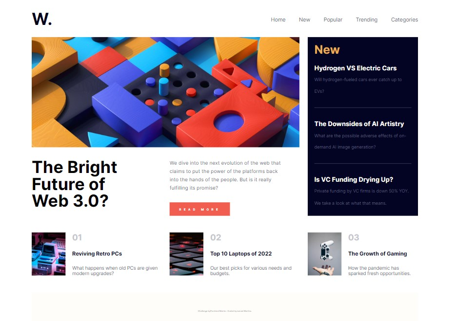

# Frontend Mentor - News Homepage

Segue solução para o desafio [News homepage challenge on Frontend Mentor](https://www.frontendmentor.io/challenges/news-homepage-H6SWTa1MFl)

## Table of contents

- [Overview](#overview)
  - [The challenge](#the-challenge)
  - [Screenshot](#screenshot)
  - [Links](#links)
- [My process](#my-process)
  - [Built with](#built-with)
  - [What I learned](#what-i-learned)
  - [Continued development](#continued-development)
  - [Useful resources](#useful-resources)
- [Author](#author)

## Overview

### The challenge

Usuarios deverão ser capazes de:

- Ter a melhor visualização do conteudo adaptada para cada tipo de tela.
- Efeito visual de hover ao interagir com o botão.

### Screenshot




### Links

- Solution URL: [https://github.com/jumaelmartins/Frontend-Mentor-News-homepage](https://github.com/jumaelmartins/Frontend-Mentor-News-homepage)
- Live Site URL: [https://jumaelmartins.github.io/Frontend-Mentor-News-homepage/](https://jumaelmartins.github.io/Frontend-Mentor-News-homepage/)

## My process

### Built with

- Semantic HTML5 markup
- CSS custom properties
- Flexbox
- Grid
- JS Vanila


### What I learned

Esse projeto serviu para eu aprimora a minha escrita de HTML, utilizando tags semanticas.
O aprendizado é um processo continuo, então pretendo continuar pra ticando.


```html
 <header class="margin flex header">
      
      <nav class="mainMenu">
        <div class="mobile">
          <button aria-label="Menu-Button" aria-controls="menuItems" aria-expanded="true" type="button" id="showMenu">
            
          </button>
        </div>
        <ul id="menuItems" class="flex hiddenMenu slideIn">
          <li><a href="">Home</a></li>
          <li><a href="">New</a></li>
          <li><a href="">Popular</a></li>
          <li><a href="">Trending</a></li>
          <li><a href="">Categories</a></li>
        </ul>
      </nav>
    </header>
```
```css
:root {
  --Soft-orange: hsl(35, 77%, 62%);
  --Soft-red: hsl(5, 85%, 63%);

  --Off-white: hsl(36, 100%, 99%);
  --Grayish-blue: hsl(233, 8%, 79%);
  --Dark-grayish-blue: hsl(236, 13%, 42%);
  --Very-dark-blue: hsl(240, 100%, 5%);
}
```

### Useful resources

- [Documentacao](https://developer.mozilla.org/pt-BR/docs/Web/CSS/CSS_Flexible_Box_Layout/Basic_Concepts_of_Flexbox) - Documentação site MDN CSS.
- [HTML Essential Training](https://www.linkedin.com/learning/html-essential-training-4/what-is-html?autoplay=true) - Fiz esse curso recentemente e ele me ajudou a pensar e estruturar o html de uma forma melhor.
- [ChatGPT](https://chat.openai.com/chat) - É uma ferramenta excellente tem me ajudado bastante a tirar duvidas.

html e css é questão de pratica então a dica que dou é continue praticando e lendo a documentação, sempre tem algo novo a aprender. tem varios conteudos gratuitos em video na internet, exlentes plataformas com conteudos free, basta buscar. quando tiver batendo cabeça, busca no ChatGPT provavelmente voce conseguirar tirar sua duvida. ;D

## Author

- Portifolio - [Portifolio_JumaelMartins](https://portfolio-jumaelmartins.vercel.app/)
- Linkedin - [@jumael-martins](https://www.linkedin.com/in/jumael-martins/)
- GitHub - [@jumaelmartins](https://github.com/jumaelmartins)
- Frontend Mentor - [@jumaelmartins](https://www.frontendmentor.io/profile/jumaelmartins)

